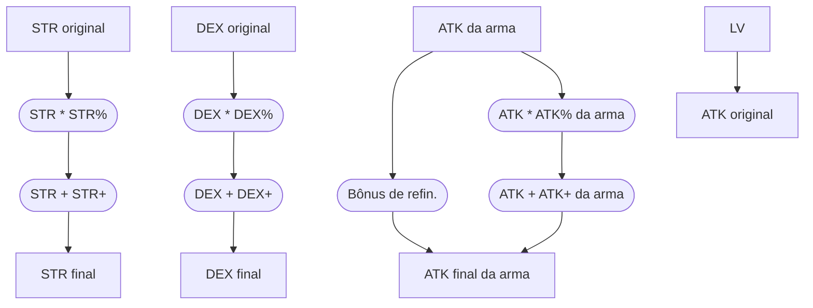

# Status
---

> [!note] Observação
> As informações são baseados no que os jogadores descobriram e alguma informação pode não estar certo!

Status é a base matemática para o jogo calcular todas as interações de batalha no jogo, que inclui danos, velocidade de ataque, velocidade de conjuração e entre outros. Os status são os dados que o jogador pode distribuir para cada vez que ele aumentar de nível ou através de recompensas no jogo.
## Calculo do status total
---

### Regra geral
---
 - Para todos os casos, o calculo básico sempre segue a ordem: 
	1. Calcula a soma dos modificadores percentual;
	2. Aplica os modificadores percentual;
	3. Arredonda o valor para baixo;
	4. Aplica os modificadores puros.

Por exemplo:
 - Personagem tem 255 de [STR](2024-07-09-Toram_STR.md);
 - Armadura tem 8% de [STR](2024-07-09-Toram_STR.md);
 - Arma tem -1% de [STR](2024-07-09-Toram_STR.md);
 - Buff de comida [STR](2024-07-09-Toram_STR.md)+18;

1. Soma dos modificadores percentual = 8% - 1% = 7%
2. Valor com modificadores percentual = 255 * 107% = 272.85
3. Valor arredondado para baixo = 272
4. Valor com modificador puro = 272 + 18 = 290

==STR = 290==

### Status percentual
---
Alguns status já são valores percentuais (exemplo: [Guard Rate](2024-07-09-Toram_Guard_Rate.md), [Guard Power](2024-07-09-Toram_Guard_Power.md), [Evasion Rate](2024-07-09-Toram_Evasion_Rate.md)). Nesses casos, basta somar todos os valores!

### Calculo final
---
Alguns status dependem de outros status, então é necessario um calculo na ordem certa! Por exemplo, [Critical Damage](2024-07-09-Toram_Critical_Damage.md) é calculado baseado no [STR](2024-07-09-Toram_STR.md), então será necessario calcular o [STR](2024-07-09-Toram_STR.md) primeiro par poder usar no calculo do [Critical Damage](2024-07-09-Toram_Critical_Damage.md).  

Para fins didáticos, os jogadores separaram os status em algumas categorias:
1. [Status básico](2024-07-09-Toram_Status_basico.md): Aqueles que podem ser adicionados ao aumentar de level;
2. [Status de equipamento](2024-07-09-Toram_Status_de_equipamento.md): ATK da arma, Equipment DEF, Weapon Stability, Refinement Resistance
3. [Status derivados](2024-07-09-Toram_Status%20derivados.md): Status que se derivam dos [Status básicos](2024-07-09-Toram_Status_basico.md).
4. [Status não-derivados](2024-07-09-Toram_Status%20não-derivados.md): Aqueles obtidos exclusivamente de equipamentos ou habilidade.
5. Status Especial: [AMPR](2024-07-09-Toram_AMPR.md), [Motion Speed](2024-07-09-Toram_Motion_Speed.md), [Unsheathe Attack](2024-07-09-Toram_Unsheathe_Attack.md).

Por exemplo, digamos que queremos calcular o valor de [ATK](2024-07-09-Toram_ATK.md) para o usuário da [[Espada de uma mão]]. Este status é baseada em ([Status básicos](2024-07-09-Toram_Status_basico.md)) [STR](2024-07-09-Toram_STR.md) e [DEX](2024-07-09-Toram_DEX.md) e ([Status de equipamento](2024-07-09-Toram_Status_de_equipamento.md)) [ATK](2024-07-09-Toram_ATK.md). Portanto os passos serão os seguintes:
1. Pegue [STR](2024-07-09-Toram_STR.md) e [DEX](2024-07-09-Toram_DEX.md) originais. Aplique o modificador [STR](2024-07-09-Toram_STR.md)% e [DEX](2024-07-09-Toram_DEX.md)% a eles.
2. Aplique o modificador plano [STR](2024-07-09-Toram_STR.md)+ e [DEX](2024-07-09-Toram_DEX.md)+ ao resultado de (1), obtemos [STR](2024-07-09-Toram_STR.md) final e [DEX](2024-07-09-Toram_DEX.md) final.
3. Pegue o [ATK](2024-07-09-Toram_ATK.md) da arma e calcule seu bônus de refinamento.
4. Pegue o [ATK](2024-07-09-Toram_ATK.md) da arma, aplique o [ATK](2024-07-09-Toram_ATK.md)% da arma e o modificador do [ATK](2024-07-09-Toram_ATK.md)+ da arma a ele.
5. Somando (3) e (4), obtemos o [ATK](2024-07-09-Toram_ATK.md) final da arma.
6. Calcule o [ATK](2024-07-09-Toram_ATK.md) a partir do nível do personagem, resultado de (2) e (5).
7. Aplique [ATK](2024-07-09-Toram_ATK.md)% e [ATK](2024-07-09-Toram_ATK.md)+ em (6), obtemos o [ATK](2024-07-09-Toram_ATK.md) final.

## Referencia
---
[Coryn Club](https://coryn.club/guide.php?key=status)

