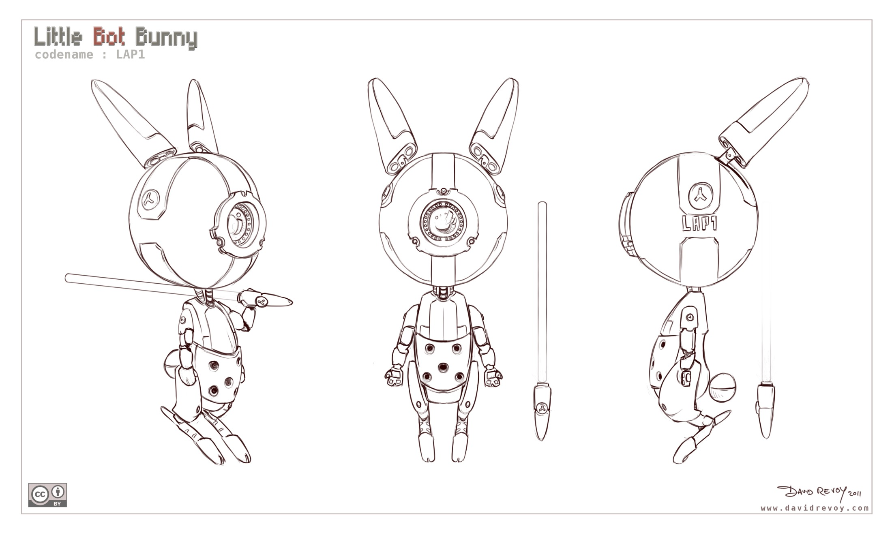

# Little Bot Bunny
---

> [!quote] David Revoy (adaptado para português)
> Aqui está um modelo gratuito do meu personagem fofo 'little bot bunny' (ou LBB, apelidado de 'Lap1'). Eu o libero sob a licença Creative Commons By. Em resumo, essa licença permite que você compartilhe gratuitamente, use gratuitamente em seu projeto (até mesmo comercial), faça derivados com ele, ensine a modelar ou faça o que quiser com ele, etc. Apenas uma condição: você deve me mencionar em seu projeto como o artista conceitual e isso deve ser publicamente visível (exemplo: "arte conceitual: David Revoy, [www.davidrevoy.com](http://www.davidrevoy.com)" em algum lugar nos créditos ou na descrição inferior, etc.). Sinta-se à vontade para usar o material 3D que quiser, personalizar, posicionar como desejar: modificações e derivados são permitidos. Exemplo: você pode fazer uma versão steampunk dele enferrujado com seu próprio design por cima.
## Concept art
---
### Line art

### Final

## Licença
---
"[Free 3D model-sheet : Little Bot Bunny](https://www.davidrevoy.com/article103/little-bot-bunny-free-3d-model-sheet "Free 3D model-sheet : Little Bot Bunny")" por David Revoy − [CC-BY 4.0](http://creativecommons.org/licenses/by/4.0/)

[Creative Commons By license](http://creativecommons.org/licenses/by/3.0/ "Creative Commons By license")

## Referencia
---
REVOY, David. “Free 3D Model-Sheet : Little Bot Bunny.” _David Revoy_. 17 Nov. 2011. Disponível em: <www.davidrevoy.com/article103/little-bot-bunny-free-3d-model-sheet>. Acessado em: 24 July 2024.