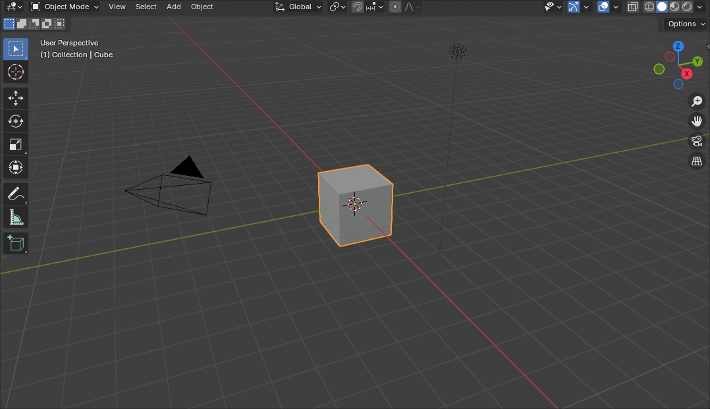

É a área de trabalho do [Blender](api/entrada/2024/07/26/Blender.md) onde será executado a modelagem e movimentação dos modelos 3D.

---

## Navegação

- Botão do meio do mouse: Rotaciona a visualização da cena;
- Shift + Botão do meio do mouse: Translada a visualização da cena;